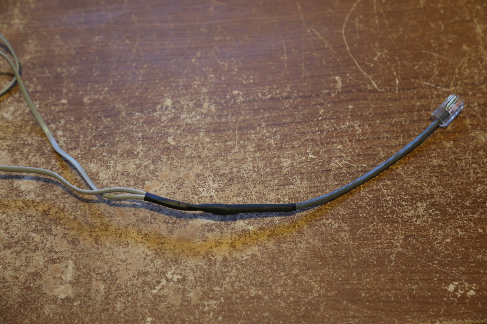

# RJ45 wiring pin layouts

All of the external sensors are terminated with a RJ45 connector to make it easy
to remove the project box without having to bring all of the associated sensors
inside. [RJ45 waterproof cable glands](https://www.adafruit.com/products/827)
are used on the project box to get the connections inside the box. Inside the
project box, all of the wires are soldered onto a
[solderable breadboard](https://www.sparkfun.com/products/12070).

## Wind / Rain Sensors Cable

The wind / rain sensors came with two separate RJ11 terminated cables. I combined
the two cables into a single piece of CAT5e to allow using the RJ45 cable glands.

Pin | Description
----|-------------
  1 | +5V
  2 | Ground
  3 | Wind speed signal - to BCM GPIO pin #18
  4 | Rain gauge signal - to BCM GPIO pin #27
  5 | Wind direction - to analog channel 0 on ADC
  6 | Unused
  7 | Unused
  8 | Unused

## Temperature / Humidity / Barometric Pressure Cable

Pin | Description
----|-------------
  1 | DHT Temperature / Humidity Signal
  2 | Unused
  3 | DHT Temperature / Humidity +5V
  4 | DHT Temperature / Humidity Ground
  5 | BMP180 I2C SCL
  6 | BMP180 I2C SDA
  7 | BMP180 +5V
  8 | Unused

